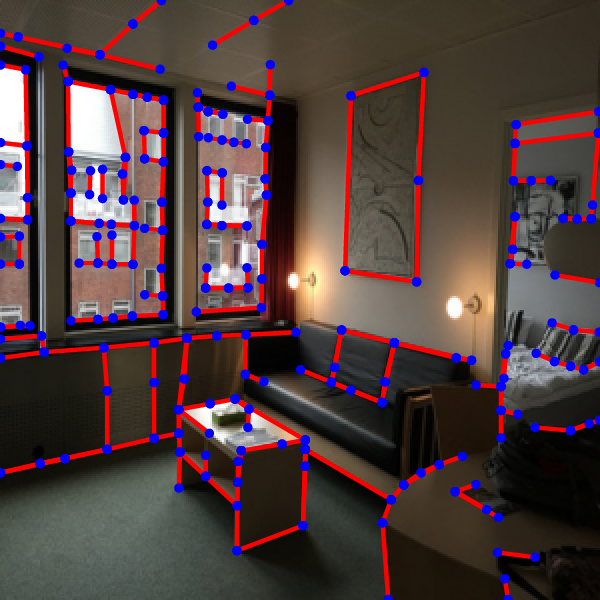
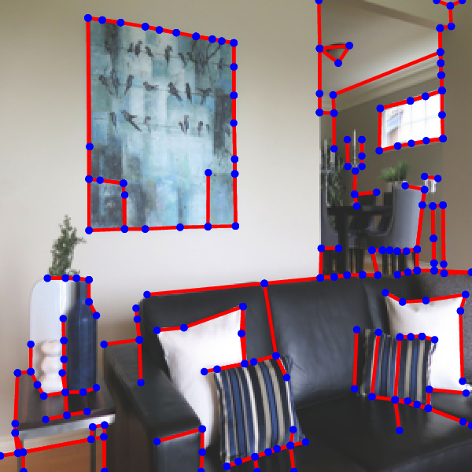
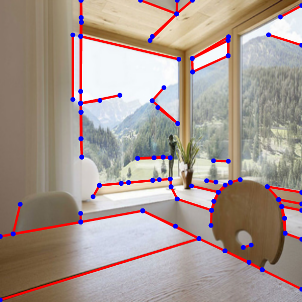
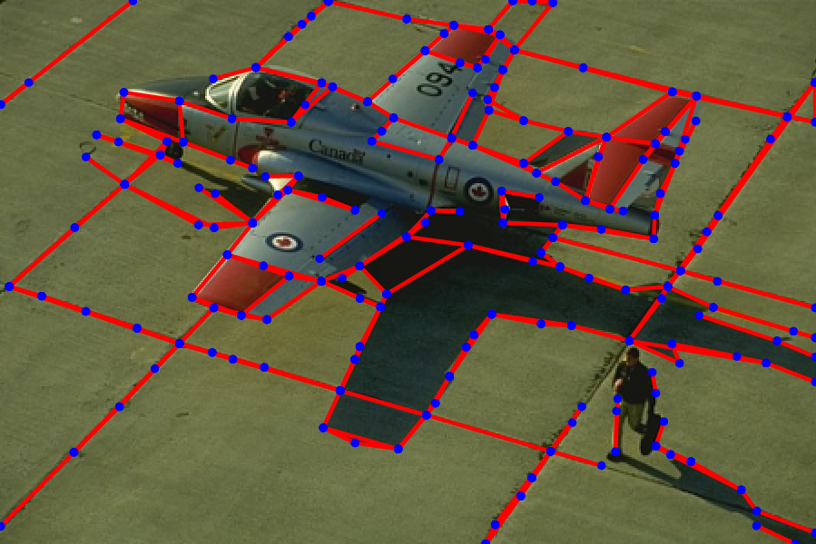
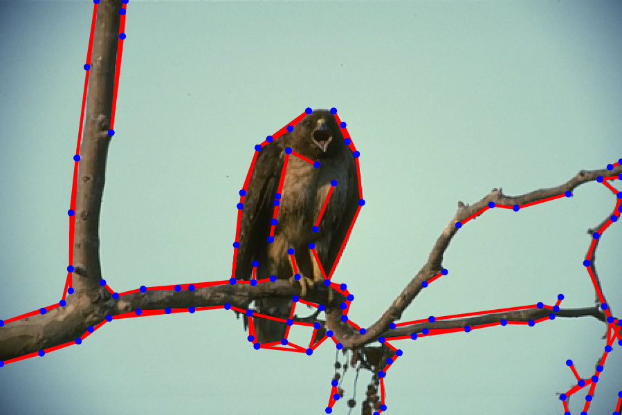
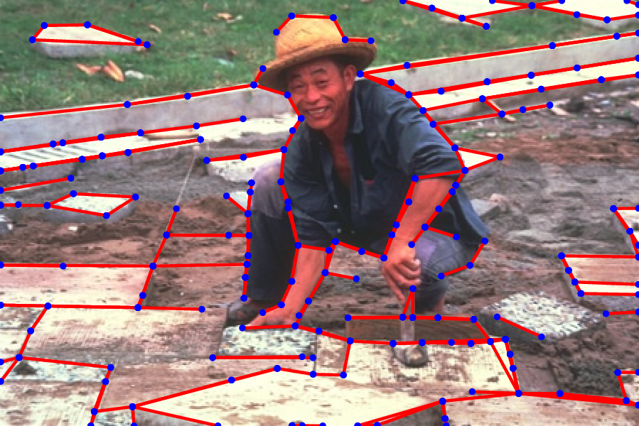
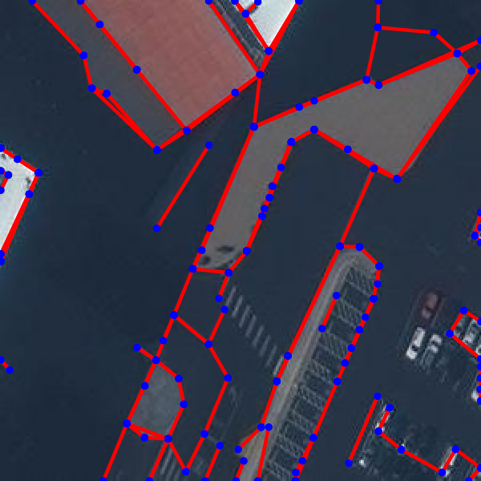
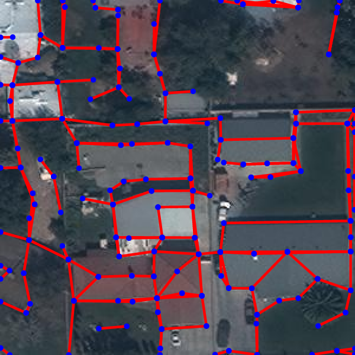
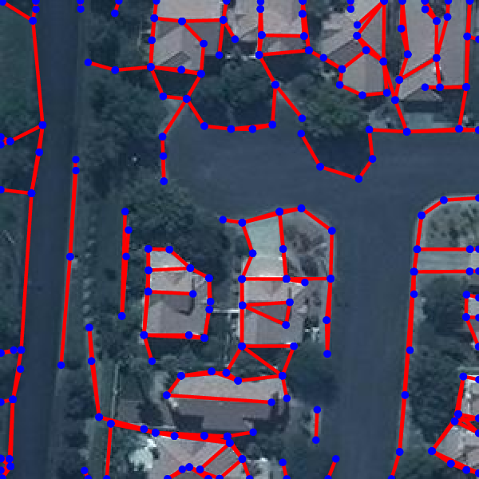
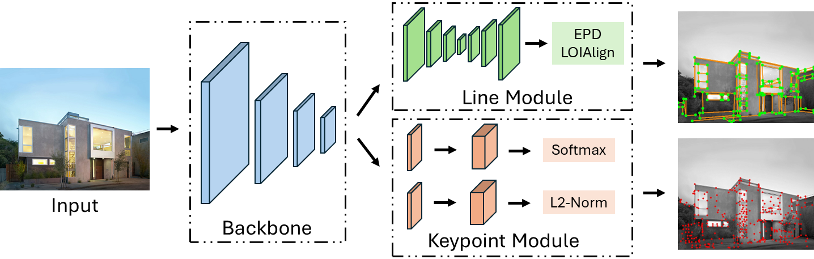

# PLNet


This is the official implementation of PLNet, which is the feature detector of our [AirSLAM](https://github.com/sair-lab/AirSLAM). PLNet is a convolutional neural network (CNN) designed to simultaneously detect keypoints and structural lines. It leverages a shared backbone and specialized headers for keypoint and line detection. The shared backbone design makles PLNet highly efficient.


<!-- <p align="center">
 
 
 
</p>
<p align="center">
 
 
 
</p>
<p align="center">
 
 
 
<p> -->

<p align="middle">
  
</p>

<!-- <p align="middle">
  
</p> -->
   
## Data Downloading
- The training and testing data (including [Wireframe dataset](https://github.com/huangkuns/wireframe) and [YorkUrban dataset](http://www.elderlab.yorku.ca/resources/york-urban-line-segment-database-information/)) can be downloaded via [Google Drive](https://drive.google.com/file/d/134L-u9pgGtnzw0auPv8ykHqMjjZ2claO/view?usp=sharing). *Many thanks to authors of these two excellent datasets!* 

- You can also use the [gdown](https://pypi.org/project/gdown/) to download the data in the terminal by
  ```bash
  gdown 134L-u9pgGtnzw0auPv8ykHqMjjZ2claO
  unzip data.zip
  ```


## Installation 
<summary><b>Anaconda</b></summary>

- Clone the code repo: ``git clone https://github.com/sair-lab/PLNet.git``.
- Install ninja-build by ``sudo apt install ninja-build``.
- Create a conda environment by
```bash
conda create -n plnet python==3.9
conda activate plnet
pip install -e .
```
- Run the following command lines to install the dependencies of PLNet
```bash
# Install pytorch, please be careful for the version of CUDA on your machine
pip install torch==1.12.0+cu116 torchvision==0.13.0+cu116 torchaudio==0.12.0 --extra-index-url https://download.pytorch.org/whl/cu116 
# Install other dependencies
pip install -r requirement.txt
```
- Verify the installation.
```bash
python -c "import torch; print(torch.cuda.is_available())" # Check if the installed pytorch supports CUDA.
```


<summary><b>Docker</b></summary>

We also provide a [Dockerfile](docker/Dockerfile). You could build the docker image by running the following command lines.
```bash
sudo docker build - < Dockerfile --tag plnet:latest
```

## Training 
Run the following command line to train the PLNet on the Wireframe dataset.

```
python -m hawp.fsl.train configs/plnet.yaml --logdir outputs
```

## Evaluation
We provide a pre-trained model that can be downloaded via [OneDrive](https://entuedu-my.sharepoint.com/:u:/g/personal/kuan_xu_staff_main_ntu_edu_sg/EbQy7pSPVNFDrP81aloP-O8BA3W0HlOqFsTi6p20KGH9xA?e=mFgVdU).

- Test using the Wireframe dataset:
  ```
  python -m hawp.fsl.benchmark configs/plnet.yaml \
    --ckpt /path/to/your/model \
    --dataset wireframe
  ```

- Test using the YorkUrban dataset:
  ```
  python -m hawp.fsl.benchmark configs/plnet.yaml \
    --ckpt /path/to/your/model \
    --dataset york
  ```


## Citations
If you find our work useful in your research, please consider citing:
```
@article{xu2024airslam,
  title = {{AirSLAM}: An Efficient and Illumination-Robust Point-Line Visual SLAM System},
  author = {Xu, Kuan and Hao, Yuefan and Yuan, Shenghai and Wang, Chen and Xie, Lihua},
  journal = {arXiv preprint arXiv:2408.03520},
  year = {2024},
  url = {https://arxiv.org/abs/2408.03520},
  code = {https://github.com/sair-lab/AirSLAM},
}
```

This code builds on HAWP and SuperPoint. Please consider citing:
```
@article{HAWP-journal,
  title = "Holistically-Attracted Wireframe Parsing: From Supervised to Self-Supervised Learning",
  author = "Nan Xue and Tianfu Wu and Song Bai and Fu-Dong Wang and Gui-Song Xia and Liangpei Zhang and Philip H.S. Torr
  journal = "IEEE Trans. on Pattern Analysis and Machine Intelligence (PAMI)",
  year = {2023}
}

@inproceedings{detone2018superpoint,
  title={Superpoint: Self-supervised interest point detection and description},
  author={DeTone, Daniel and Malisiewicz, Tomasz and Rabinovich, Andrew},
  booktitle={Proceedings of the IEEE conference on computer vision and pattern recognition workshops},
  pages={224--236},
  year={2018}
}
```


